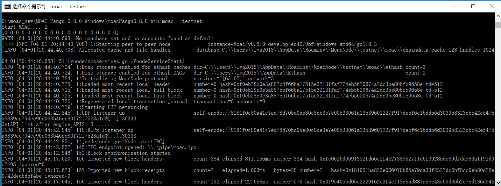
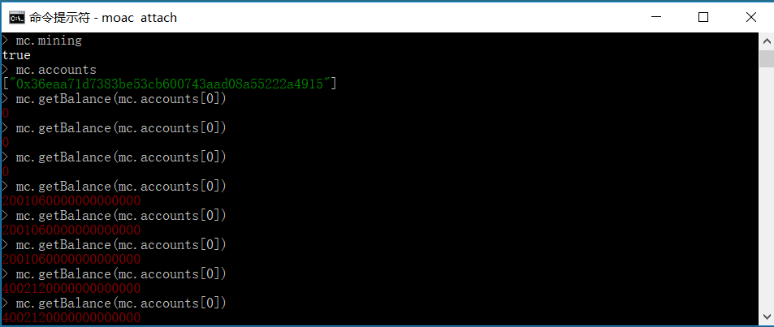
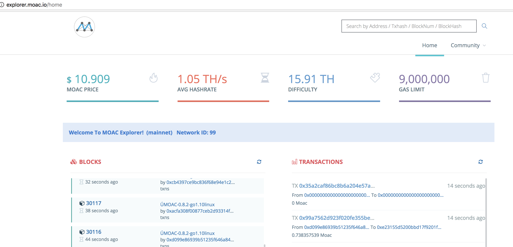
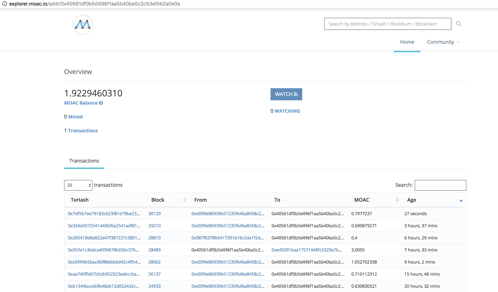
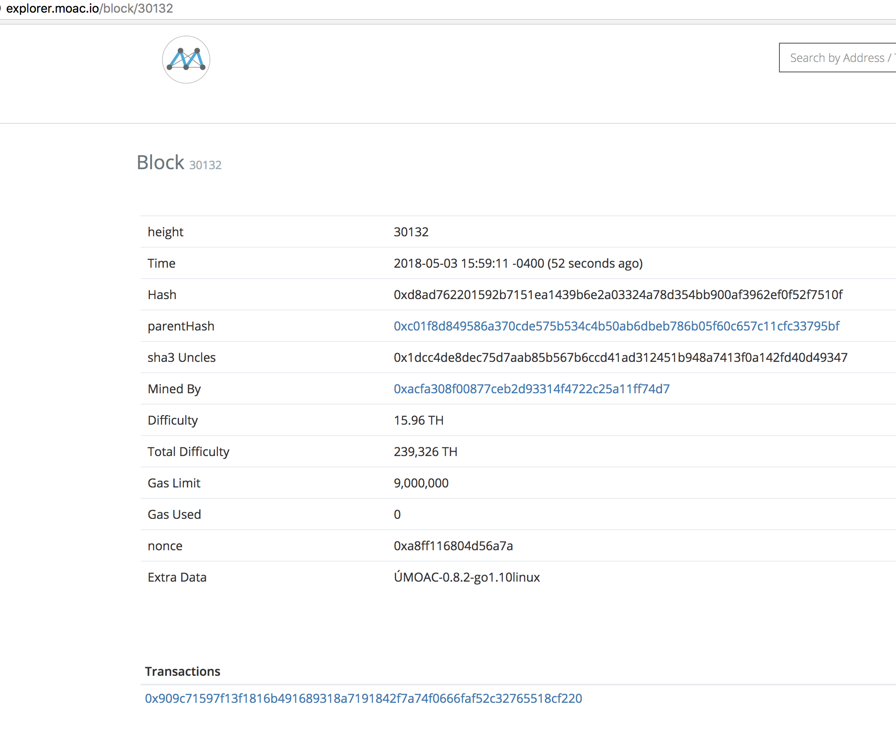

Setup
=========

MOAC release
------------

Download from latest release version of VNOE from `release
link <https://github.com/MOACChain/moac-core/releases>`__

Debian/Ubuntu/CentOS
~~~~~~~~~~~~~~~~~~~~

1. Untar the file using tar, under the directory, run ./moac

To see the help, use ./moac --help

To enable the console, run: ./moac console

A mainnet directory will be created under $HOME/.moac/ and some info
should be seen as:

::

    INFO [04-24|11:24:26.506] 86161:IPC endpoint closed: /home/user/.moac/moac.ipc 

from another terminal, run moac again to attach the running node

::

    ./moac attach 

or

::

    ./moac attach $HOME/.moac/moac.ipc

2. from console prompt, create coinbase account

   ::

       >personal.newAccount()

3. from console prompt, start mining by running

   ::

       >miner.start()

4. from another terminal, run moac again to attach the running node

   ::

       ./moac attach

5. from prompt, load script

   ::

       >loadScript("mctest.js")

6. check if miner has mined any moac by checking:

   ::

       >mc.accounts

7. create another account

   ::

       >personal.newAccount()

8. try send from one account to another:

   ::

       >Send(mc.accounts[0], '', mc.accounts[1], 0.1)

WINDOWS
^^^^^^^

Unzip the file to a directory, under the directory, run
moac.exe

To see the help, use moac.exe --help

To enable the console, run: moac.exe console

A mainnet directory will be created under  and some info
should be seen as:

2.1 查看moac帮助
''''''''''''''''

打开命令（cmd）终端，转到墨客解压目录，在命令行中执行：

::

    D:\moacPangu0.8.2-win>moac --help

显示帮助信息，包含但不限于以下内容：

查看moac帮助

打开命令（cmd）终端，转到墨客解压目录，在命令行中执行：

::

    D:\ moacPangu0.8.2-win>moac --help

显示帮助信息，包含但不限于以下内容：

::

    Start MOAC.... 2
    NAME:
     moac - the MOAC-core command line interface
     Copyright 2017 The MOAC Authors
    USAGE:
     moac [options] command [command options] [arguments...]
    VERSION:
     0.8.2-develop-ed4070bf
    MOAC CORE OPTIONS:
    --config value                      TOML configuration file
    --datadir "C:\Users\[userName]\AppData\Roaming\MoacNode" Data directory for the databases and keystore
    --keystore                         Directory for the keystore (default = inside the datadir)
    --nousb                           Disables monitoring for and managing USB hardware wallets
    --networkid value                   Network identifier (integer, 1=Pangu, 2=Testnet) (default: 1)
    --testnet                          MOAC test network: pre-configured proof-of-work test network

2.2 运行节点
''''''''''''

打开命令（cmd）终端，转到墨客当前目录，在命令行中执行：

::

    D:\ moacPangu0.8.2-win>moac

显示如下信息：

   moac\_install\_win\_0

至最后三行显示如下：

::

    INFO [04-01|20:44:42.851] 1:[node/node.go->Node.startIPC]
    INFO [04-01|20:44:42.852] 145:IPC endpoint opened: \\.\pipe\moac.ipc
    INFO [04-01|20:45:12.846] 152:Block synchronisation started

表示节点安装成功，如果网络正常，就开始同步区块。

系统将MOAC节点默认安装在目录：

::

    C:\Users\[userName]\AppData\Roaming\MoacNode\

该目录下包含两个文件夹：moac和keystore。

2.3 进入MOAC console界面
''''''''''''''''''''''''

系统关机或主动关闭运行中的节点后，如果需要重新启动节点，在命令行中执行：

::

    D:\ moacPangu0.8.2-win>moac console

之后一直滚屏以同步区块数据。

打开另一个命令（cmd）终端，转到墨客当前目录，在命令行中执行：

::

    D:\ moacPangu0.8.2-win>moac attach

.. figure:: image/moac_install_win_1.png
   :alt: moac\_install\_win\_1

   moac\_install\_win\_1

该命令行不会主动滚屏，而是等待命令。

3. 挖矿
^^^^^^^

3.1 建立新账户
''''''''''''''

挖矿前必须建立一个自己的账户。

进入MOAC console界面，执行命令：

::

    > personal.newAccount()

系统会提示输入一个密码，例如"passwd"，并再次输入相同密码确认后，会显示一个以0x开头的字符串，即为MOAC帐号的公开地址。

.. figure:: image/moac_install_win_2.png
   :alt: moac\_install\_win\_2

   moac\_install\_win\_2

系统同时会在以下目录：

::

    C:\Users\[userName]\AppData\Roaming\MoacNode\testnet\keystore

记录一个账号文件。请保存好该文件，并牢记密码，之后用于解密帐号和操作。

3.2 查看账户
''''''''''''

进入MOAC console界面，执行命令：

::

    > mc.accounts

可以查看本节点下的所有账号。

3.3 查看账户余额
''''''''''''''''

进入MOAC console界面，执行命令：

::

    > mc.getBalance(mc.accounts[0])

可以查看本节点下的账号余额。0表示第一个账户，也是默认挖矿账户。

或者：导入“mctest.js”的情况下（见4.1），执行命令：

::

    > checkBalance()

该命令用于查看当前节点所有账号的余额。

3.4 查看挖矿状态
''''''''''''''''

进入MOAC console界面，执行命令：

::

    > mc.mining

返回true表明节点正在挖矿，false表明节点没有挖矿。

3.5 开始挖矿
''''''''''''

进入MOAC console界面，执行命令：

::

    > miner.start()

挖矿状态下，数据显示有明显不同。

.. figure:: image/moac_install_win_4.png
   :alt: moac\_install\_win\_4

   moac\_install\_win\_4

挖到矿之后，可以查看余额

   moac\_install\_win\_5

登录墨客区块链浏览器页面： http://explorer.moac.io。

   moac\_explorer\_0

在搜索栏输入你的挖矿账号地址，会显示该账号的余额等信息。

   moac\_explorer\_1

在搜索栏输入你挖到矿的区块号，会显示该区块的信息。

Miner正是你的账号地址。

   moac\_explorer\_2

3.6 停止挖矿
''''''''''''

进入MOAC console界面，执行命令：

::

    > miner.stop()

4. 交易
^^^^^^^

4.1 读入测试函数
''''''''''''''''

部分功能程序存储在mctest.js里。

进入MOAC console界面，执行命令：

::

    > loadScript("mctest.js")

4.2 交易条件
''''''''''''

为执行交易，需要至少两个帐号，其中一个有足够的mc。

如果没有目标账号，可以用步骤2.3.1的命令创建一个本地账号。并用命令：

::

    > mc.accounts

显示当前节点中存储的账号，应该至少有一个挖矿账号。

4.3 交易
''''''''

进入MOAC console界面，执行命令：

::

    > Send(mc.accounts[0], 'passwd', mc.accounts[1], 0.1)

这个过程需要第一个账号的密码。比如'passwd'，发送额为0.1 mc。

.. figure:: image/moac_install_win_6.png
   :alt: moac\_install\_win\_6

   moac\_install\_win\_6

在系统挖矿的情况下，发送应该在下一个区块产生时完成。

系统显示的是以 **sha（Sand）** 为单位的余额， **1 mc = 1e18 sha。**
