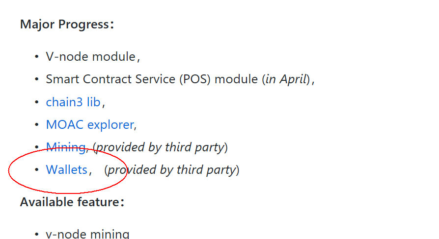

TokenPocket钱包
^^^^^^^^^^^^^^^

https://github.com/MOACChain/moac-core

点击进入上面网址后，点击wallets进入。  |token\_pocket\_entry|

TokenPocket
是一款移动端轻钱包APP，它旨在为普通用户提供一款安全放心、简单好用、功能强大的数字资产钱包应用，使用起来非常流畅，也符合国内用户的使用习惯，全中文界面，适合新手使用。

另外这款钱包整合了多体系数字资产可供选择和存放（多资产钱包，目前暂支持以太坊底层和井通底层发行的Token，后续逐渐添加更多底层。），未来还可以支持在钱包中进行跨链交易（真正的跨链原子交易），最大程度的便利了用户对数字资产的保存和流通。

TokenPocket使用图文教程开始

这里以安卓版本的TokenPocket为例：

首次安装好以后打开，点APP进入登录界面会有相关系统权限提示，点击始终允许即可：（极个别的无法创建和导入钱包的就是因为权限设置这里的问题，具体的可以到设置--应用里面去找到TokenPocket去设置权限）

一、TokenPocket 创建钱包

\ |token\_pocket\_create\_wallet|

创建钱包

钱包体系：创建钱包，需要选择钱包体系，当前暂支持以太坊体系和井通体系，后续还会添加比特币体系、EOS等体系，这里以以太坊体系为例。

钱包名称：输入自己喜欢的名字即可；

设置密码：密码这里没有做硬性要求，但是建议数字+字母，字母大写小写搭配等方式，至少输入8位，会在你做转账等敏感操作的时候要求输入，务必牢记。

提示信息：可以输入一些相关的提示词等（可不填）。

服务条款：只有勾选才可以成功的创建钱包，服务及隐私条款可点击进行详情查看。

以上要素填写完毕以后，点击创建钱包即可完成以太坊体系钱包的注册。

二、TokenPocket 备份助记词

助记词实际上就是明文私钥的一种表达形式，可以等同于私钥，好处是用12个单词代替一大串0,1二进制数私钥，方便记忆和备份（此处强烈建议抄在纸上保存好，不要用网络存储，最好再找个地方保存起来），恢复钱包时最便捷，只需要导入助记词就好。

坏处就是一旦丢失和私钥丢失一样，谁知道了你的助记词就等于知道私钥，就等于你的地址里的币存在丢失的可能，并且永远找不回来，所以网络上凡是需要填写私钥和助记词的地方都要慎重再慎重。

\ |token\_pocket\_backup\_wallet|

备份钱包（助记词备份），可以防止你的钱包丢失，这个过程务必要完成，否则钱包无法使用，即使退出app重新登录后还会提示进行备份。

点击备份钱包，记录下弹出的界面中12组英文单词，记录到你的实体本子上面，并妥善保管好。具体如下图所示：

\ |token\_pocket\_backup\_mnemonic|

记录完毕后点击下一步，从界面中按照正确的顺序来搭配正确的12组英文单词。

三、TokenPocket 添加新资产

在资产一栏，点右上角的加号，点击添加资产，会看到添加资产的界面，可以快速的根据体系来进行Token的添加和删除

\ |token\_pocket\_add\_asset|

四、TokenPocket 导入钱包

1、点击初始界面中的导入钱包，如下图所示：

\ |token\_pocket\_import\_wallet|

选择体系

2、点击需要导入的钱包类型，这里以以太坊体系为例，点击以太坊弹出如下界面：

\ |token\_pocket\_select\_asset|

助记词导入

3、钱包导入类型分为：助记词和私钥，这里先来演示助记词的钱包导入方法，在置顶的输入框中正确输入12组英文单词以后（空格分隔），还需要填写相关项方可正确添加钱包。

选择格式：这里按照系统给出的默认值即可；

钱包名字：这里可以选择自己喜欢的名字进行设置，跟原钱包（例如imtoken之前的钱包名称不要求一致，个人自由设置即可。）

钱包密码：重新设置自己易记的密码即可，要求8位以上；

提示信息：可以输入一些相关的提示词等（可不填）。

勾选同意服务及隐私条款后点击开始导入。

4、私钥导入是指，利用创建钱包以后备份的明文私钥进行钱包导入，再导入的时候要注意私钥大小写的区分，如果出现错误就耐心进行检查，直到正确输入为止，私钥导入如下所示：

\ |token\_pocket\_import\_private\_key|

私钥导入

在置顶的输入框中输入明文私钥

钱包名字：这里可以选择自己喜欢的名字进行设置，跟原钱包（例如imtoken之前的钱包名称不要求一致，个人自由设置即可。）

钱包密码：重新设置自己易记的密码即可，要求8位以上；

提示信息：可以输入一些相关的提示词等（可不填）。

勾选同意服务及隐私条款后点击开始导入。

五、TokenPocket 私钥备份

助记词和私钥对于钱包来说同等重要，基本上可以理解为：助记词=密钥=keystore+密码，由于keystore只有在以太网页钱包中才有导出备份功能，所以这里不做过多演示。

点击钱包主界面中的我，会弹出如下界面：点击管理钱包，弹出如下界面：这里可以看到已经创建过的钱包，点击我们需要备份私钥的钱包，会提示输入密码提示框，正确的输入密码之后，弹出如下界面：

\ |token\_pocket\_backup\_private\_key|

为了安全起见，此明文私钥最好也记录到本子上妥善保管。

.. |token\_pocket\_create\_wallet| image:: image/tp_wallet_1.png
.. |token\_pocket\_backup\_wallet| image:: image/tp_wallet_2.png
.. |token\_pocket\_backup\_mnemonic| image:: image/tp_wallet_3.png
.. |token\_pocket\_add\_asset| image:: image/tp_wallet_4.png
.. |token\_pocket\_import\_wallet| image:: image/tp_wallet_5.png
.. |token\_pocket\_select\_asset| image:: image/tp_wallet_6.png
.. |token\_pocket\_import\_private\_key| image:: image/tp_wallet_7.png
.. |token\_pocket\_backup\_private\_key| image:: image/tp_wallet_8.png

