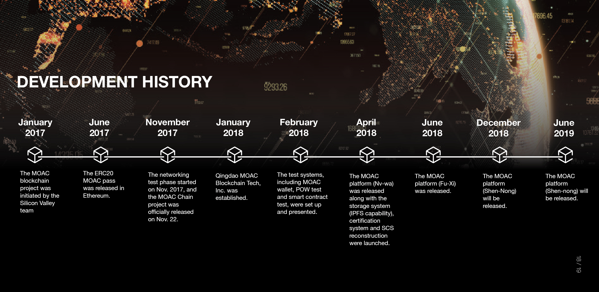

About MOAC
----------

Mother of All Chain (MOAC) Blockchain

MOAC offers many services for people who want to use the blockchain
technology for business. MOAC has a layered configuration structure,
asynchronous contract calls and it uses sharding solutions.

MOAC will make pluggable validation schemes and create a wider
participation in the validation process of the blockchain for different
users.

MOAC will also make it easy to deploy sub blockchains and intend to
offer easy solutions for small companies that want to create sub
blockchains by themselves.

History
~~~~~~~

Team
~~~~

.. figure:: image/MOACteamEn.png
   :alt: moac\_key\_person

ICO
~~~

The crowdsale of MOAC happened in June 2017. There are total 75,000,000 MOAC used in the ICO. Total 56,483,386 MOAC was
sold during the ICO time and the rest is held in private investors.

MOAC tokens can also be mineable, so mining is a viable alternative if
you want to have the tokens. At first you will be able to be rewarded
with 2 MOAC tokens per block but this number will decrease by half
whenever 12,500,000 MOAC tokens have been already mined.
