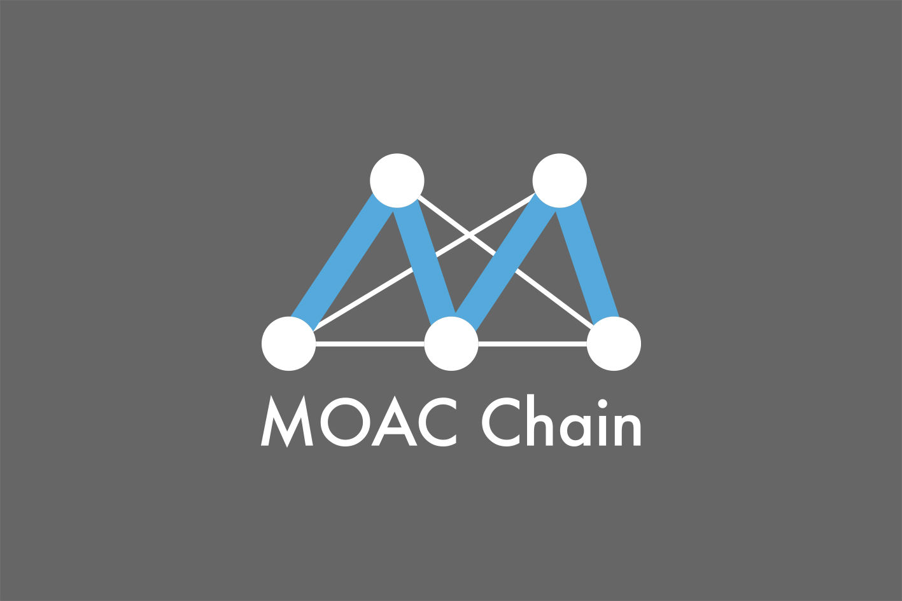

   moac\_log

墨客区块链——众链之母，革命性的商用区块链架构系统

MoacChain——The Mother of All Chains，A commercial blockchain
architectural system of revolution

1. 关于墨客
^^^^^^^^^^^

1.1 墨客简介
''''''''''''

Mother of All Chain (MOAC) Blockchain (简称
“MoacblockChain”，中文音译为“墨客区块链”）是一个开源的区块链平台，通过分层配置结构实现在P2P网络上支持多种子区块链，由硅谷顶级区块链专家团队研发，突破了异步合约调用、合约分片处理和跨链操作等当前业界难题，平台的扩展能力和对合约的处理速度远远优于当前如以太坊智能合约平台，是一款真正可以部署商业应用的区块链底层平台。

Moac旨在提供一种可扩展且有弹性的区块链，支持基于分层结构的状态交易，数据访问，和控制流程。它创建了一个框架以允许用户用高效的方式执行智能合约。它还提供了开发的体系结构，采用底层基础设施来快速简便地产生子区块链。它是一个区块链平台，可以为子区块链的架设提供必要的部件，为想法测试，私链部署，复杂任务处理和智能合同应用等提供解决方案。

1.2 发展历程
''''''''''''

.. figure:: image/moac_history.png
   :alt: moac\_history

   moac\_history

1.3 创始团队
''''''''''''

.. figure:: image/moac_key_person.png
   :alt: moac\_key\_person

   moac\_key\_person

1.4 项目优势
''''''''''''

**硅谷一流团队：**
墨客团队由井底望天、陈小虎、杨韵乐等数十位在硅谷有20年IT、6年区块链研发经验的顶级技术专家构成。此前，他们已经成功开发井通平台，并积累了4年区块链商业落地经验。

**高速性能：**
相对于以太坊每秒7-14次交易速度，墨客可以提高100倍，在优化条件下，甚至到1000倍的处理速度。

**POP技术：**
墨客采用独有的POP技术。其他系统要么坚持pow，要么坚持pos，要么混合pow+pos，都无法有效利用两者的优点，和避免两者的缺点。墨客采取底层物理网用pow，上层智能合约的逻辑网用
pos，使得两者的优点都能兼顾，可以称为pop (pos over pow)。

**原子跨链：**
墨客采用系统特有的系统定时触发功能和子链的功能，完美避免了需要修改被跨链的区块链底层及无法自动化的问题，使得墨客成为有跨链能力的区块链系统。
